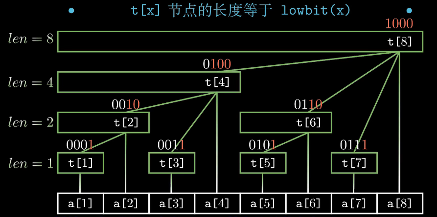

数组不变 区间求和：前缀和 树状数组 线段树

单点修改 区间求和：树状数组 线段树

区间修改(区间内所有元素都加 或都减某个常数) 区间求和：树状数组 线段树

区间修改(区间内所有元素都变成同一个数) 区间求和：树状数组 线段树

区间修改 输出最终结果：差分

总结：
虽然线段树比较全能 都可以做 但是代码量属实太大 不到必须用的时候尽量用树状数组

- 简单求区间和：前缀和
- 单点修改/区间修改(都加或都减) 区间求和：树状数组
- 区间修改(变成同一个数) 区间求和：线段树 
- 区间修改 但只要最终结果：差分

# 线段树
线段树适用于元素会变化的区间问题 比如区间求和 求最大公因数 主要是这类具有结合律的问题 比如整体的和等于左右两部分的和 整体的最大公因数 等于左右两部分最大公因数的最大公因数

参考：B站视频 正月点灯笼 线段树

线段树的实现有多种方式，数组、链表、结构体等等 这里使用数组实现 而且都已求和为例子进行说明

线段树的核心思想：树的节点出存储的是区间信息 比如根节点表示整个区间的和 叶子节点表示单个点的值 因此叶子节点的数目等于原数组的长度 一般初始化线段树时 用4*n的大小

主要组成部分：
- build 构建线段树: 即求出每一段区间的状态并赋给每个节点 这里使用递归实现 比如根节点表示[0 - n]的区间和 则根节点的左节点表示[0 - n/2]的区间和 右节点表示[n/2 + 1 - n]的区间和 一直递归下去 直到碰到叶子节点 即表示的区间的左右两端相等 此时直接将原数组的值赋给他即可

- update 更新线段树: 这里分为单点修改以及区间修改
  - 对于单点修改 整体思路和构建线段树时一致 都是左右递归实现 需要判断是往左边递归还是右边 直到碰到需要修改的叶子节点 修改值 并修改父节点的值(pushUp)
  - 对于区间修改 这里利用额外维护一个lazy数组信息 表示当前节点需要变化的量 同时每个父节点都要把这个lazy的量传递给他的两个子节点(pushDown)

- query 查询区间和: 即给定区间的两个端点(l, r)求出区间和 这里依然是使用递归实现 将[l, r]拆成[l, mid] + [mid + 1, r]的区间和 然后在线段树中进行递归直到求得这些小的区间和

代码实现：  
- nums表示原数组  
- tree表示树形数组(将一棵树通过数组表示 具体来说就是节点 p (表示数组中的第p个位置)的左孩子为 2 * p ,右孩子为 2 * p + 1，注意tree[0]不放节点 因为2 * 0 = 0)  
- mark表示懒标志 用于优化update使得每次更新不需要遍历所有节点 只有当用到的时候才根据mark来更新数据

 线段树

<pre><code class = "language-cpp">
#include <iostream>
#include <vector>

using namespace std;

int MAXN = 1e5 + 5;
int m, n; // m for numbers ; n for operation
vector<int> nums(MAXN, 0), tree(4 * MAXN, 0), mark(4 * MAXN, 0);

void build(int l = 1, int r = n, int p = 1) {
    // build segment tree recursively
    if(l == r) tree[p] = nums[l];
    else {
        int mid = l + (r - l) / 2;
        build(l, mid, 2 * p);
        build(mid + 1, r, 2 * p + 1);
        tree[p] = tree[2 * p] + tree[2 * p + 1];         
    }

} 

void update(int l, int r, int d, int cl = 1, int cr = n, int p = 1) {
/**
 * @brief update the number in interval [l, r]: add d, and current node is p with interval [cl, cr]
 * 
 */
    if(cl > r || cr < l) return ;  // no intersection 
    else if(cl >= l && cr <= r) {
        // target interval contain current interval
        if(cr != cl) mark[p] += d;  // for non-leaf node, update mark[p]
        tree[p] += (cr - cl + 1) * d;
    } else {
        // have intersecion; transform into left and right child-node 
        int mid = cl + (cr - cl) / 2;
        mark[2 * p] += mark[p];
        mark[2 * p + 1] += mark[p];
        tree[2 * p] += mark[p] * (mid - cl + 1);
        tree[2 * p + 1] += mark[p] * (cr - mid);
        mark[p] = 0;
        update(l, r, d, cl, mid, 2 * p);
        update(l, r, d, mid + 1, cr, 2 * p + 1);
        tree[p] = tree[2 * p] + tree[2 * p + 1]; 
    }
}

int query(int l,int r, int cl = 1, int cr = n, int p = 1) {
    /**
     * @brief query the sum of the interval [l, r] with current node p and interval[cl, cr]
     * 
     */
    if(cl > r || cr < l) return 0;
    else if(cl >= l && cr <= r) {
        return tree[p];
    } else {
        int mid = cl + (cr - cl) / 2;
        mark[2 * p] += mark[p];
        mark[2 * p + 1] += mark[p];
        tree[2 * p] += mark[p] * (mid - cl + 1);
        tree[2 * p + 1] += mark[p] * (cr - mid);
        mark[p] = 0;
        return query(l, r, cl, mid, 2 * p) + query(l, r, mid + 1, cr, 2 * p + 1);
    }
    return 0;
} 

int main() {
    cin >> n;
    cin >> m;
    vector<int> opers(m, 0);
    vector<int> xs(m, 0);
    vector<int> ys(m, 0);
    int oper, x, y;
    for(int i = 0; i < m; i++) {
        cin >> oper;
        opers[i] = oper;
    }
    for(int i = 0; i < m; i++) {
        cin >> x;
        xs[i] = x;
    }
    for(int i = 0; i < m; i++) {
        cin >> y;
        ys[i] = y;
    }

    build();
    for(int i = 0; i < m; i++) {
        oper = opers[i];
        x = xs[i];
        y = ys[i];
        if(oper == 0) {
            // update x_i to y_i
            update(x, x, y - tree[x]);
        } else {
            // output the sum of interval [x_i, y_i]
            cout << query(x, y) << " ";
        }
    }

}
</code>
</pre>

# 树状数组
树状数组的核心思想：类似于前缀和 但不是单纯的前n项的和 而是和下标的二进制表示有关的前缀和 下面这张图可以一目了然

有以下规律
- 第一个1右边的0的个数对应了所表示的求和的个数 比如0001就表示一个数 为叶子节点 0010表示a[1] a[2]两个数的和 以此类推 
- 要求1 - n的前缀和 可以通过第n个数逐步往前走 每次走的步数为len个长度 比如求前5个元素的和 从t[5]开始 由于len = 1所以往前走1个 到达t[4] 此时len = 4 到达0 因此sum[5] = t[5]+t[4]
- 单点更新 比如要要对a[5]+4 则首先t[5]+4 然后逐步往后走 每次走的步数也是len 因此走到t[6] 也要加4 然后继续走 走到len = 2 到达t[8]也要加4 这样就更新完了

