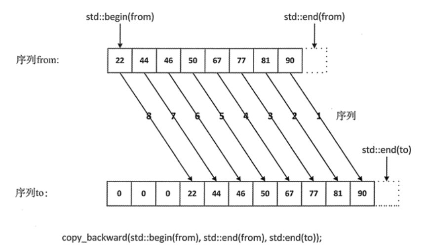

# STL源码剖析 读书笔记

## STL概论
源码路径：D:\MinGW\lib\gcc\mingw32\9.2.0\include\c++\bits

### OOP 与 GP
- OOP: Object oriented programming 
面向对象编程，即将数据、函数等一系列东西都封装在一个类中
- GP: generic programming
类属编程 可以提供更加灵活的组装效率而不损失效率

### STL六大组件
1. 容器(containers) 包含vector, list, deque, set, map
2. 算法(algorithms) 包含各种常用算法sort, search, copy, erase
3. 迭代器(iterators) 也被称为泛型指针 用于链接容器和算法 容器内部存储数据，利用迭代器将数据传入算法中进行计算
4. 仿函数(functions) 不理解这个概念
5. 适配器(adapters) 用于修饰容器或者仿函数或者迭代器的接口 比如stack和queue都是基于deque实现 所以被称为容器适配器 
6. 分配器(allocators) 用于管理内容空间 主要是分配内存与回收内存

## 分配器

VC6下的 allocators 调用 operator new 分配内存 而 operator new 调用 malloc 进行分配内存 所以 
> allocators -> malloc
> 
> remark: 调用malloc 除了你申请的内存空间外 他会有一些额外的的overhead 包括 分配的空间大小 一些断点调试用得到的空间 以及一些用于padding的空间 具体内容看C++的内存管理
> 
> 类似的 deallocator 调用 operator delete 而 operator delete 调用 free 进行内存回收 所以 deallocator -> free
>
> 总结：VC的allocators没有实现其他的特殊功能 只是单纯的封装了以下malloc 和 free

BC的allocators实现类似

GNUC中allocators实现类似 但还提供了一些扩展的alloc 其中包括了一个2.9版本作为allocators的实现 现在叫做pool_allocator内存池的意思 

pool_allocator的实现思想在于摆脱malloc带来的额外开销 设计了16条链表 每条链表上的节点表示固定大小的内存空间 由于容器中元素的大小是固定的 所以可以省去malloc中用于记录大小的部分 从而达到了节省开销的目的
> 这一部分的代码实现也在内存管理中会有讲

## 代码实现  
相关的头文件：
- construct.h 实现构造函数 以及 析构函数
- allocator.h 实现内存的分配以及回收 对new 以及 delete的简单封装
- memory.h 对前两个头文件的封装？？？
- uninitialized.h 对于未初始化的空间的构造？？？ 这一部分的必要性？？？
- alloc.h 一二级分配器以及内存池的部分 暂时不考虑实现 效率会比allocator.h高 

配置器的作用：为容器分配内存空间 以及 最后回收内存  

### new操作符 delete操作符

**new 操作符本质上是调用malloc申请一块新的内存** 源码来自libsupc++

operator new

<pre><code class = "language-cpp">
//libsupc++ new_op.cc
_GLIBCXX_WEAK_DEFINITION void *
operator new(std::size_t sz) _GLIBCXX_THROW(std::bad_alloc)
{
    void *p;
    /*malloc(0) is unpredictable; avoid it. */
    if(__builtin_expect (sz == 0, flase))
        sz = 1;
    
    while((p = malloc(sz)) == 0) 
    {
        /*
        p = 0说明malloc分配内存失败 需要异常处理 
        */
        // get_new_handler函数获得一个处理malloc为0 的函数 即异常处理函数
        new_handler handler = std::get_new_handler();
        // 若不存在异常处理函数 则抛出异常
        if(!handler) _GLIBCXX_THROW_OR_ABORT(bad_alloc);
        // 若存在异常处理函数 则调用
        handler();
    }

    return p;
}
</code></pre>

对于operator new的使用 有三种形式：  
void* operator new (std::size_t size) throw (std::bad_alloc);  
void* operator new (std::size_t size, const std::nothrow_t& nothrow_constant) throw();  
void* operator new (std::size_t size, void* ptr) throw();  
第一种分配size个字节的存储空间，并将对象类型进行内存对齐。如果成功，返回一个非空的指针指向首地址。失败抛出bad_alloc异常。  
第二种在分配失败时不抛出异常，它返回一个NULL指针。  
第三种是placement new版本，它本质上是对operator new的重载，定义于#include <new>中。它不分配内存，调用合适的构造函数在ptr所指的地方构造一个对象，之后返回实参指针ptr。  
第一、第二个版本可以被用户重载，定义自己的版本，第三种placement new不可重载。  
A* a = new A; //调用第一种  
A* a = new(std::nothrow) A; //调用第二种  
new (p)A(); //调用第三种  
new (p)A()调用placement new之后，还会在p上调用A::A()，这里的p可以是堆中动态分配的内存，也可以是栈中缓冲。

> remark: new 和 operator new是不一样的
> new operator就是new操作符，不能被重载，假如A是一个类，那么A * a=new A;实际上执行如下3个过程。  
（1）调用operator new分配内存，operator new (sizeof(A))  
（2）调用构造函数生成类对象，A::A()  
（3）返回相应指针  
事实上，分配内存这一操作就是由operator new(size_t)来完成的，如果类A重载了operator new，那么将调用A::operator new(size_t )，否则调用全局::operator new(size_t )，后者由C++默认提供。  

**delete操作符本质上是对free的调用** 

operator delete 

<pre><code class = "language-cpp">
// del_op.cc
_GLIBCXX_WEAK_DEFINTION void
operator delete(void* ptr) noexcept
{
    std::free(ptr);
}
</code></pre>

### construct.h
STL中的构造函数主要是对placement new的封装

# 实例分析：
SGI_STL中有多种alloc 这里只分析STD alloc即standard allocator

以vector的源码位例进行分析 主要有两个类：vector_base 以及 vector  
- vector_base主要用于调用allocator分配内存空间 并没有进行初始化
- vector为主类 继承vector_base 主类中包含vector对象的construct 以及其他一系列的函数诸如 iterator\reverse_iterator\...\front\back\push_back\erase\insert\resize\swap等函数

这里分成两个类就体现了STL设计allocator时 将对象的初始化分成两个阶段这个理念：分配内存 + 对象构造  即alloc + construct两部分  

我们先看vector的构造方式：
以下资料参考[cpp_vector_construct]:https://www.apiref.com/cpp-zh/cpp/container/vector/vector.html
- count个值为value(default为0)
- 复制构造函数 以other为对象进行构造
- 移动构造函数 使用other的分配器移动构造获得 移动后other为empty  
还有很多其他的构造 这里只实现1、2种最简单的

对于count个值为value的构造函数  通过调用uninitialized_fill_n构造  
对于复制构造函数 通过调用uninitialized_copy构造
所以construct里面需要有这两个函数

另一个比较重要的函数是push_back / insert  
- push_back: 在最后插入一个数据
- insert: 有几种用法
  - insert(Iterator pos, value) 在pos这个位置前插入value这个值 使得value变成Iterator pos这个位置
  - insert(Iterator pos, count, value) 在pos这个位置前插入count个value这个值
  - insert(Iterator pos, iterator begin, iterator end) 在pos这个位置前插入从[begin, end) 的数据 注意左闭右开

对于插入数据 通过辅助函数insert_aux(iterator _pos, const &x)实现  
这个函数的意思就是将x插入到pos的位置  
具体实现：
- pos != end(即分配的空间还有剩余 可以继续插入数据 则将pos - end的位置的元素往后移一位 然后将pos处的值更改为x即可  
  - 具体怎么移一位：首先将最后一个位置的空间利用构造函数构造为倒数第一个位置的元素 
  - construct(M_finish, *(M_finish - 1)) 
  - 这里的M_finish即为最后一个位置 理解为vector.end() 注意end()这个位置是没有元素的 
  - 然后M_finish++ 再调用copy_backward(_pos, M_finish - 2, M_finish - 1) 
  - 这个函数的意思 是将_pos - M_finish - 2的数据 从后往前依次插入到M_finish - 1之前 
  - 插入后数据的顺序不变 不过是先插入后面的元素 相当于逆序插入元素
  - 有张图帮助理解 
- pos == end 则分配的空间不够了 需要扩大空间 扩大为原来的两倍 然后将原来的数据cpoy到新分配的空间中 再删除原来分配的空间以及数据  然后更新vector类中的M_start, M_finish, M_end_of_storage等数据

如果是push_back 
- 只需要在后面已经分配的空间中初始化数据即可 若已经分配的空间用完了 则将重新开辟一块2倍大的空间 将原数组的元素移动到新空间中 再加入新数据  这里调用insert_aux时pos的参数为end  

如果是insert 
- 如果插入的位置在尾部 且有空间剩余 直接在尾部构造新对象即可
- 否则 就调用insert_aux 
- 最后返回插入的位置即可 (begin() + n)  // n = pos - begin() 

