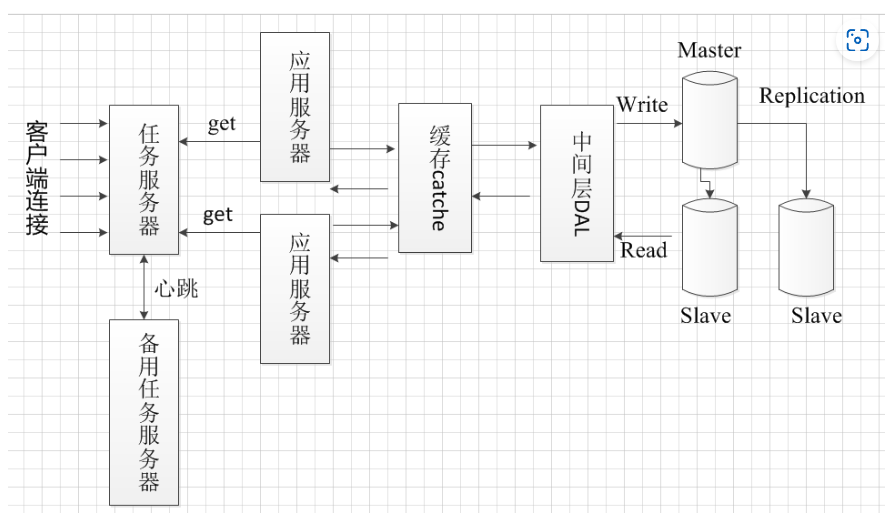
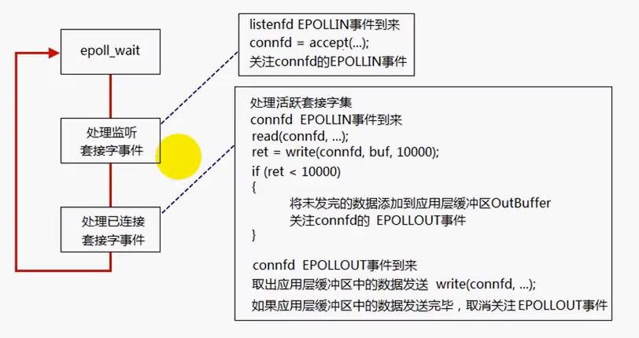
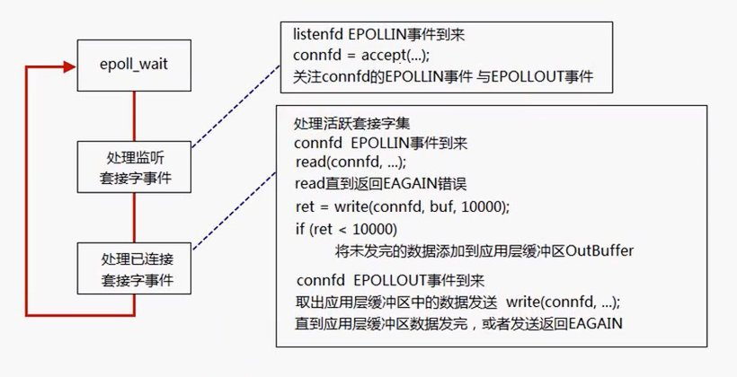

该文档用于记录muduo视频中的笔记 不涉及具体的代码实现

项目想法：
把服务器的功能设置成获取一些加密算法的介绍以及加密公私钥获取的代码？？？或者直接传输公私钥 

项目方面要更注重加密通信 隐私保护要做好 这方面可以多了解一点 通信的隐私方面

# 1.大并发服务器架构介绍
所有的服务器模型都可以总结为 C - S 模型 即Client-Server模型 还有一种叫做B-S(Browser Server)的浏览器-服务器模型也可以看作是C-S模型 把浏览器看作客户端

最基本的服务器框架由服务器与数据库构成

客户端连接 ---> 应用服务器 <-----> 数据库服务器

上述最简单的模型存在的问题在于数据库的并发数存在上限 这就对客户端的请求数有所限制 比如数据库的最大连接数为1000 此时由10000个客户端发起了访问数据库的请求 由于数据库本身的并发数的限制 导致9000个客户端只能等待 

可以通过在应用服务器与数据库服务器间增设DAL(data access layer)数据访问层来减轻数据库的压力 DAL可以采用队列以及连接池设计 (这两个设计具体如何减轻压力？尤其是队列？) 所以模型变更成下面的样子

客户端连接 ---> 应用服务器 <-----> DAL层 <-----> 数据库服务器

增设DAL层只能降低服务器的压力 并没有提高服务器的处理速度 这一点可以通过增设缓存 将访问过的数据加载到缓存中 这样下次再有客户端申请查询服务器的数据 就可以先查看缓存中是否由这个数据 若存在 直接从缓存中拉取数据 就不用访问数据库了 

客户端连接 ---> 应用服务器 <-----> 缓存Cache <-----> DAL层 <-----> 数据库服务器

引入缓存后 新的问题又出现了 就是数据库中的数据会更新 我们如何保证缓存中的数据是正确的 而不是过期的呢 有两种方式
- 为缓存设置时效性 经过一定的时间后 就设置缓存失效 若客户端申请这个数据时缓存失效了 就只能取数据库查询了 同时更新缓存
- 当客户端申请修改数据库的数据时 直接更新缓存 并将要修改的数据放进DAL层 当数据库空下来的时候 在更新到数据库中

缓存的不足之处
- 缓存池不可能无限大 当缓存池存满的时候 需要将不活跃的数据换出来 写入新的数据 这类换页算法有以下几种
  - FIFO(First In First Out)
  - LRU(Least Recently Used)
  - LFU(Least Frequently Used)
- 当然还有其他的改进 比如缓存的预读失效 
- 上述这些都不需要自己去实现 有开源的技术 非关系型数据库 nosql 比如 Redis memcached等都可以直接拿来用
- 缓存可以和应用服务器部署在同一台机器上 也可以独立部署在一台机器上 更推荐后者 因为这样当应用服务器较多时 都可以较快的访问缓存

增设缓存只解决了客户端访问数据库记录的请求 如果客户端申请修改数据库的记录 由于锁的存在 大量的写请求仍然存在瓶颈 此时由于有锁的存在 读的操作也需要等候 因此可以设计读写分离 由于数据库中读操作总是多于写操作 因此可以使用负载均衡 即多复制几个数据库 数据库之间存在主从关系 用于写的数据库是master 用于读的数据库是slave 当master中的数据被修改后 更新到slave数据库 那么这里的负载均衡主要是复制数据库的操作 这一点主流的数据库都有replication机制可以帮助完成

类似的 应用服务器上一般有多个功能 也可以根据不同的功能实现负载均衡 一个应用服务器专门处理一个或几个功能 

同时设计一个任务服务器 监控各个应用服务器的状态 并将客户端的请求分配给各个应用服务器 这里有两种分配方式
- 任务服务器根据各个应用服务器当前的负载决定分配给谁 一般是分配给负载最低的那个
- 应用服务器自行向任务服务器申请任务
- 这两种若客户端的任务都大同小异 则用前一种 大家都是平等的 所以有任务服务器进行统一分配 若每个应用服务器处理的任务不一样 则由应用服务器自行申请更好

我们还需要考虑任务服务器出现故障的情况 因此我们需要多设置几个任务服务器 实现failover的机制 多态任务服务器之间实现心跳 当检测不到心跳时 自己成为主任务服务器

至此 服务器模型变为如下形式

为了进一步提高数据库的性能 可以对数据库进行分区 主要有以下两种分区方式
- 分库(垂直分区) 即将不同的表分为不同的库 但是由于SQL中大部分请款下存储的表之间都有关系 因此这么存会带来很多不便 不推荐
- 分表(水平分区 推荐) 将一个表拆分多分存到不同的库里去 就相当于减少每个库中存的记录数 可以一定程度上避免锁的竞争

服务器开发的性能杀手：
- 数据拷贝 数据从内核态copy到用户态 或者在用户态之间copy会造成性能损失 可以通过缓存解决这类copy问题
- 环境切换 多线程频繁的切换上下文造成开销 若服务器是单核的 采用状态机方式单线程效果最好 如果是多核的 合理的使用多线程(就是说不要太多了 线程 否则多线程带来的提升还填不满环境切换带来的开销)
- 内存分配 采用内存池 提前分配内存
- 锁竞争 合理的写代码 避免使用锁

# 2.poll
IO复用 写一个回射程序

客户端：
  1. socket 建立套接字
  2. ipton 建立服务器地址以及端口号
  3. connect 连接到服务器
  4. 输出服务器端的ip地址以及端口号
  5. write 写入数据 stdin 
  6. read 读取服务器回射数据
  7. 打印服务器回射数据 stdout
  8. 关闭套接字

服务器端：使用poll 监听多个文件描述符 IO复用 业务流程主要就是回射客户端的数据
  1. socket 创建监听套接字
  2. setsocket_opt 设置监听地址的重复利用
  3. bind 监听套接字绑定服务器地址以及端口号(端口号若不指定 则由系统自动分配)
  4. listen 开始监听
  5. 建立pollfd的结构体以及vector 用于存放待访问的fd
  6. poll 开始轮询 利用while循环 然后 Poll返回值n表示事件个数 
  7. 若n > 0 则表示有套接字事件发生 由于一开始我们只加入了监听套接字 并发在第一个位置 需要先判断监听套接字的返回事件是否为POLLIN
  若是 则调用accept 接受客户端的连接 同时得到一个连接的文件描述符 将该文件描述符设置为sock_nonblock | sock_cloexe状态方便后序的操作 或者这里可以直接调用accept4函数 可以直接设置返回的套接字状态
  8. 处理完上述监听套接字后n-- 并输出客户端的ip以及端口号 并判断 n > 0 判断是否继续轮询
  9. 若n>0 说明还有其他的套接字事件产生了 第一轮由于只有监听套接字 所以是不肯能的 但是之后由于第一轮新加入了套接字 所以是有可能的
  10. 若其他套接字产生了事件 则调用read函数 并调用业务代码 这边的业务是回射客户端数据
  11. 这里遍历其他的套接字事件 可以用for循环做 判断条件为pollfd.reevents == pollin 以及 n > 0

关于服务器端设计的思考：
1. 为什么要用poll IO复用
   - linux中有关IO共有5种：阻塞式IO, 非阻塞式IO, IO复用(select, poll, epoll), 信号驱动式IO, 异步IO
   - IO: TCP信息传输过程：用户输入数据 -> 发送缓冲区 -> 网络传输 -> 接收缓冲区 -> 服务器内核接收数据 -> 用户态接收数据
   - 网络数据传输是一段一段的传的 因此用户在申请从内核读取数据时 有时会没有数据可读 若此时该线程一直等待数据到来 就称为阻塞 若直接返回告知没有数据 就称为非阻塞 由于非阻塞 所以需要反复调用函数询问是否有数据到达
   - 阻塞式IO：用户进程进行系统调用访问内核数据 若没有数据到达 则一直等待直到数据到来 
   - 非阻塞式IO：用户进程进行系统调用访问内核数据 若没有数据到达 则直接返回错误代码 用户进程反复进行系统调用 耗费大量cpu资源 因为大部分时间 都是在做无用功的调用 若一个服务器连接了多个用户 则需要分配多个线程不断地进行系统调用 不适合高并发服务器
   - IO复用：与非阻塞式类似 不过不是每个进程单独轮询一个描述符 而是分配一个线程轮询所有的描述符 减少资源消耗 本质上仍然是遍历所有的描述符 
     - select 与 poll 类似 都是维护一个文件描述符列表 然后轮询 区别在于select维护的列表存在上限1024(32位的电脑) 而poll没有上限 
       - 二者的局限在于 
       - 1.二者都是线性扫描 即轮询 效率较低(epoll中会为socket注册回调函数 当有事件发生时 会自动完成相关操作 避免轮询) 
       - 2.二者都需要将维护的描述符列表fd_set从用户态拷贝至内核 在内核中处理 处理完之后 又从内核拷贝至用户态 浪费资源(这一点在epoll中也会有所改进)
     - [epoll](#epoll)
   - 信号驱动式IO：
   - 异步IO：
2. 为什么要设置套接字状态为sock_nonblock | sock_cloexe
3. 关于Poll的C++语法 

# 3.epoll
  

## epoll的两种触发方式
> EPOLLIN 事件 
内核中的socket接收缓冲区 为空   低电平  
内核中的socket接收缓冲区 不为空 高电平  
> EPOLLOUT 事件 
内核中的socket发送缓冲区不满    高电平  
内核中的socket发送缓冲区满      低电平  

>LT: 电平触发(水平触发)  高电平触发  
>EL: 边沿触发(垂直触发)  低电平->高电平 / 高电平->低电平  触发  

## epoll函数解析
头文件：<sys/epoll.h>
- int epoll_create(int size) / int epoll_create1(int flags)
  - epoll_create的参数size已经不再使用 可以省略 这个参数在早期版本用于指定分配给文件描述符的个数 现在由内核动态的分配 所以这个参数可以省略 如果仍然要加 加一个正数(为了兼容旧版本 否则会报错EINVAL)
  - epoll_create1(int flags) 新的版本 更加常用 若flags = 0 则就是没有size参数的epoll_create函数 flags可以设置为EPOLL_CLOEXEC 表示加入epoll的文件描述符都设置为EPOLL_CLOEXEC(？？？) 
    - EPOLL_CLOEXEC: 一般来说 进程往往会调用fork()生成子进程 然后子进程调用exec()执行其他的程序 而子进程会继承父进程的所以信息 所以该文件描述符在子进程中也是打开的 设置FD_CLOEXEC表示当子进程调用exec()时 会关闭该文件描述符
  - 返回值：返回一个epoll文件描述符epfd(> 0) 若error 则返回-1
  - 推荐使用epoll_create1(EPOLL_CLOEXEC)

- int epoll_ctl(int epfd, int op, int fd, struct epoll_event *event)
  - 用于增加、删除、修改 epoll的监视对象
  - epfd: epoll的文件描述符 通过调用函数epoll_create1(inf flags)返回
  - op: 操作
    - EPOLL_CTL_ADD 往epoll中加入感兴趣的事件
    - EPOLL_CTL_MOD 修改epoll中的fd的事件对应的event的属性 
    - EPOLL_CTL_DEL 删除epoll中的事件
  - event: 事件的结构体
    - 两部分组成1. uint32_t events; 2.epoll_data_t data; (epoll_data_t: unoin{void *ptr; int fd; uint32_t u32; uint64_t;}
    - events的取值范围
      - EPOLLIN: fd文件等待读 即可以读了
      - EPOLLOU: 可以写了
      - EPOLLRDHUP: 当客户端关闭连接 或者 shut down半连接的时候收到的事件

- epoll_wait(int epfd, struct epoll_event *events, int maxevents, int timeout)
  - epoll_wait用于返回活跃的事件数 其中*event是一个返回参数 包含了活跃的事件
  - maxevents: 最多可返回的事件数
  - timeout: 超时时间 若>0 表示epoll_wait是阻塞的 若超过timeout都没有活跃事件 则直接返回 若=0 则直接返回 若<0 表示epoll_wait非阻塞

## epoll基本流程

LT模式：
- epoll_wait得到活跃的套接字
- 遍历活跃的套接字 
  - 若为监听套接字(一个线程只能有1个监听套接字吗？？？) 则调用accept得到连接套接字 epoll_ctl注册该连接套接字 关注EPOLLIN事件(读事件)
  - 若为连接套接字 则调用read函数 读取数据 若读取数据为0 则客户端关闭连接 删除该套接字 否则根据业务逻辑写入返回客户端的数据 若写入的数据大于发送缓冲区 则没办法一次性写完所有的数据 需要分包 此时注册该套接字的EPOLLOUT事件(写事件) 然后下次epoll_wait再遍历的时候就可以继续写入了 若写入完毕 则需要将EPOLLOUT事件取消关注 

ET模式：
- ET模式与LT模式大致上相似 不过需要关注由于触发方式不同所带来的异常处理
- 若数据没有读干净 则接收缓冲区会一直保持高电平 这样就算后面再有新的数据进来 由于不会变成低电平 所以无法触发ET 也就一直读不到数据了

## epoll异常处理
1. EMFILE
- 该错误出现于accept时 若已经连接的套接字数量到达了系统能够连接的上限 则此时会返回EMFILE错误(Error Max File descriptor)
- 解决办法：可以预先设置一个空的文件描述符idlfd 若遇到EMFILE 则close(idlfd) 就空出来一个文件描述符 调用idlfd = accept() 然后再调用close(idlfd)也就是说和客户端连接成功后 立马结束连接 这是为了防止之后再次出现这样的情况 毕竟遇到EMFILE这种错误只是暂时的 所以可以这么处理
2. EAGAIN
   

## epoll与poll以及select对比分析
1. epoll就一定比poll以及select高效吗？
- 不一定。
- epoll更适合高并发的情况 当已连接套接字不多 并且这些套接字非常活跃的时候 epoll由于内部的实现更加复杂 所以可能还不如poll以及select。 
- epoll比起poll以及select高效的地方在于
  - 1.不是线性的扫描所有的套接字 而是设置回调函数 每次调用epoll只返回活跃的套接字 然后只需要遍历这些活跃的套接字进行处理 而poll每次都返回所有的套接字 然后遍历所有的套接字 判断是否有返回事件 若有则处理事件 这种方法在高并发且大部分套接字不活跃的时候会做很多的无用功
  - 2.epoll不需要拷贝文件描述符 epoll注册过一次后 文件描述符就存在于内核之中 之后每次调用无需从用户态将文件描述符拷贝到内核中 而poll以及select每次调用 都需要将维护的文件描述符数组拷贝到内核中 之前也提过 在高并发的情况下 数据拷贝是性能杀手  

# 代码优化1

将epoll、socket、inet等过程都封装成一个类 隐藏底层细节 提供调用接口 加强代码可读性

原来的echo代码逻辑全部都写在server文件中 后期若想增加一个server 就需要再写一遍这个代码 效率低 不如把其中重复的工作提取出来封装一下 优化代码可读性 这样之后增加服务器 可以直接调用封装后的函数 这里封装是不是需要考虑灵活性 比如你新增一个服务器 他的fd的状态的设置？？

原来的服务器逻辑：
1. 调用socket生成fd 用于连接客户端
2. 设置服务器地址 这中间包括生成地址 转化地址等
3. 调用bind地址 并调用Listen 开始监听是否有连接
4. 创建epoll_fd用于监听epoll事件
5. 创建eventlist 并加入lis_fd以及其对应事件EPOLLIN
6. 调用epoll_wait得到活跃事件保存于数组中 开始轮询
7. 若为lis_fd 连接客户端 并将返回的连接fd加入epoll 设置事件为EPOLLIN
8. 若为普通的fd以及EPOLLIN事件 则说明客户端发送请求 调用handle函数处理请求 并返回
9. 若为普通的fd以及EPOLLOUT事件 则说明可以发送消息给客户端 则调用网络函数发送客户端请求的资源

封装的逻辑：
1. 创建服务器 包括fd = socket() bind listen accept
2. 设置服务器地址
3. epoll 包括设置epfd 创建epoll_event数组 轮询事件 当然回调处理函数不包含在里面 因为这个由服务器的业务逻辑决定 不同的连接涉及的回调操作不同

有关epoll的操作 主要是epoll_event这个结构体不太明白
每个fd 对应一个epoll_event 其中包含事件以及一个data(union类型)
事件：EPOLLIN, EPOLLOUT, EPOLLRDHUP
data：ptr, fd, uint32_t, uint64_t 这个参数 目前只用到了fd 
data这个参数是一个union 类似于struct 不过里面只能有一个成员可以赋值

由于每个客户端连接后的conn_fd都有一个epoll_event 所以需要有一个vector<epoll_event>来记录所有的事件 
这个参数在epoll_wait中用作返回参数 返回活跃的事件
在epoll_ctl中用作输入参数

对epoll的封装包含 添加fd 轮询返回活跃事件 以及一个构造函数和一个析构函数 构造函数生成epfd 以及数组 析构函数删除数组以及close(epfd)

  - socket: 
    - 构造函数 无参数/提供参数
    - 析构函数 close fd
    - bind
    - listen
    - accept
    - fcntl（设置nblocking ecex等等）
    - gerFD
  - epoll
    - epfd监控的文件描述符
    - struct epoll_event* 事件数组
    - 构造函数 构造一个epfd用于监听
    - 析构函数 关闭 epfd
    - addFd 添加监听对象
    - poll 轮询有事件的对象 并进行处理
  - InetAddress
    - 构造函数  无参数/提供参数(点分式的地址 以及 端口号)
    - 析构函数
    - 成员变量：sockaddr_in地址 以及socklen_t 地址的长度
  - 

# 4.Channel
   为什么添加channel 添加之后有什么需要改动的 相比于之前有什么提升
   以及 还存在什么问题 这过程中存在什么难点

   之前的每一个连接都是往epoll的红黑树上添加文件描述符 但是一个文件描述符所包含的信息太少 不同类型的连接需要提供不同类型的服务 因此我们需要一个东西包含更多的信息

   在epoll_event这个数据结构里 有一个成员是union结构 之前就是通过这上面的data.fd来绑定文件描述符 而这个union还有一个是data.*ptr 是一个指针 可以指针任何一块内存 也就可以存放很多的信息 所以我们将这个指针指向一个channel类 
   
   简单来说 这个channel类就是对fd的封装 

   因此这个channel 类中需要实现原来服务器accept得到的fd的功能

   原来的流程：
   - server调用accept得到fd 生成epoll_event 赋值.data.fd = fd
   - 调用epoll_ctl(epfd, ctl_add, fd, &epoll_event)添加监听事件
   - 每次调用Poll进行轮询 得到epoll_event数组 根据其中每个元素的fd来判断执行何种操作
   - 若fd为serv_fd 则添加新连接
   - 若为普通的fd 则根据event事件执行 EPOLLIN为可读事件 调用handleReadEvent(fd)

   现在用channel对fd进行封装 相当于channel是一条连接epoll和sock_fd的隧道。每当有一个客户端连接到服务器 都会新建一个客户端到epoll的隧道; epoll利用这个隧道对所有的sock_fd进行轮询 判断事件并进行处理。而原来直接用fd就相当于sock_fd和epoll直接用一根细线相连 只有一个fd信息在这之间传递 改为用channel后可以二者之间的连接可以容纳更多的信息 epoll可以有更多的处理逻辑，还有就是利用channel将二者之间的这种连接关系抽象出来了 对于不同的fd channel有更多的可操作空间

  

# 5.EventLoop
   进一步抽象服务器 将整个server看作两部分:
   - 创建服务器(调用serevr类)
   - 创建Epoll类 并开始轮询  ->   这一块抽象成Eventloop Epoll类为其中一个成员变量
  
   为了将二者绑定起来 server类中需要新增成员 *loop指向Eventloop

   > 为什么是在server类中新增成员*loop 而不是在Eventloop类中新增 *serv? 
   - 因为对于eventloop来说 serv_fd 和 其他客户端的fd是处于同等地位的 只是二者的处理逻辑不同 对于serv_fd 是连接事件 而其他客户端的fd是其他的可读可写事件 所以要在serv中新增loop变量  否则就要在Eventloop中增加所有的fd变量

   在Channel中新增函数 设置回调函数 具体的调用在server中调用(因为回调函数设置在channel创建的时候 而创建channel的时机 一个是创建server的时候 另一个是连接客户端accept的时候 这两个时机都在server类中发生 也就是说server类中 主要有三个逻辑： 创建服务端; 执行连接函数; 执行可读事件);  
   这里的解释还是有点牵强
   > 为什么需要回调函数
   - 因为现在poll的轮询中是统一进行处理的 loop中不含有关服务器的信息 所以无法判断执行逻辑是什么 因此需要在fd 和 Epoll类的连接 即 Channel中设置回调函数 自动的根据不同的fd来调用回调函数 这个回调函数在一开始生成Channel的时候就需要绑定好 

   > 设置回调函数有什么方法?
   - bind函数 以及 function 都是C++11的新特性

# 6.Server类抽象出 acceptor类 以及 connection类
之前的逻辑：
server类的工作逻辑：
  - 初始化server类 首先绑定一个服务器地址 然后创建channel绑定到epoll上 设置回调函数为newConnection: 这个函数用于接受新的连接 并输出连接客户端信息
  - 最后enableReading
  - 然后在newConnection中 接受新的连接后 创建客户端的channel 绑定到epoll上 设置回调函数为handleReadEvent 用于echo客户端发送的消息 最后enableReading 
  - 对于handleReadEvent 输入参数只有一个客户端的fd 因为这其中只涉及到read 以及 write这两个函数 需要用到建立连接的fd即可

现在将上面两部分 接受连接以及处理连接的IO抽象成两个类acceptor类 以及 connection类
- acceptor类 用于接受连接 相当于对server类初始化那一块的封装 由于需要绑定到epoll上 所以需要eventloop对象 用于初始化 然后创建channel 绑定回调函数
- 但是这里需要注意 接受的客户端连接 应该由server类进行管理 也就是原server类中的后半部分的connection 一个连接对应一个connection对象
- 所以具体的连接逻辑还是在server类中 我们需要在server类中初始化acceptor类时为acceptor绑定回调函数 可以调用到server类中的连接函数
- 然后在acceptor类中 只需要初始化服务器的地址 设置channel 绑定回调函数 这里的回调函数为对server类中的回调函数newconnection的封装

- connection类 用于处理连接的IO事件 首先需要新建客户端的channel 绑定到epoll上 并设置回调函数 这里的回调函数即为业务处理逻辑handleReadEvent : echo函数
- 不过这里还需要对connection进行管理 即当客户端断开连接时 需要从server管理的connection中删去已经建立的连接 在之前的代码中 若客户端断开连接 则会删除客户端的fd 这里通过析构函数来实现 不过已经建立的连接应该由server来管理 因此需要在server中设置回调函数

上面两个抽象过程很像 都是新建socket然后 新建channel绑定到epoll 然后设置回调函数 然后enableReading
区别在于acceptor这个类的生命周期由server类管理 而由acceptor建立的连接类connection中的对象的生命周期由server类管理 所以server类中会有一个accrptor类对象以及connection的数组 以及deleteconnection的回调函数 acceptor的建立连接的逻辑还是在server类中 不过server类的初始化放在acceptor中了 然后connection的处理逻辑是放在自己的类中

更新代码的过程中需要明确每一部分代码负责的功能 然后按需添加新的类 以及 往对应的类中添加成员函数 和 变量 
这里connection类的功能就是对服务器和客户端的连接的抽象 需要对这个已经建立的连接上的IO事件进行处理 设置回调函数 所以这里不应该涉及任何服务器相关的信息(因为连接已经建立) 同时不应该涉及任何 建立连接 这个过程的代码 建立连接这个过程放在acceptor中 connection类和sever类的联系在于 由server类管理connection类的声明周期 1.在server类中创建 connection对象 2.在connection类中回调server类中的函数对server类进行销毁

# 其他
本章节记录一些做项目过程中遇到的写代码的习惯问题
## 异常处理
目前做的项目的异常处理逻辑大致类似 因此封装一个异常处理函数以供快速调用
<pre>
<code>
void errif(bool condition, const char * errmsg){
    if(condition) {
      perror(errmsg);
      exit(EXIT_FAILURE);
    }
}
</pre>
</code>

参数:
  - condition: 判断异常的条件 比如socket()的返回值为负数等
  - errsg: 输出异常信息

> Remark:
- 当前项目的异常处理函数比较简单 仅输出异常信息以及终止服务器
- 在正式的项目中 服务器应该是7*24不间断的工作 所以不能够简单的让服务器推出 应该想一些其他的处理方式

- 比如：在调用accept接受客户端的连接时 若遇到连接数已满 则会返回EMFILE错误 为了应对这个异常问题 可以在服务器启动时就设置一个空的连接idle_fd 这样当遇到连接已满的错误时 就可以暂时释放这个idle_fd 用于连接客户端 但是此时需要马上断开该连接 保证永远有一个idle_fd可以处理该类异常

## ifdef以及pragma once
作用: 为了避免同一个头文件被include多次 可能会造成定义冲突 以及降低程序的运行效率

方式：
<pre><code>
#ifndef __SOMEFILE_H__
#define __SOMEFILE_H__

...

#endif
</pre>
</code>

<pre><code>
#pragma once
</pre>
</code>

区别:
- ifndef 
  - 可以保证同一个文件不会被包含多次 还能保证内容完全相同的两个文件或者代码片段不会被不小心同时包含 
  - 缺点在于如果不同头文件中的宏名相同 可以会导致头文件存在 但是编译器说找不到声明的情况 
  - 同时 由于编译器每次都需要打开头文件才能判定是否有重复定义 因此在编译大型项目时 ifndef会使得编译时间较长
- pragma once
  - 可以保证同一个文件不会被包含多次 这里的同一个文件是指物理意义上的同一个文件 而不是内容相同的两个文件 
  - 好处在于不用担心宏名冲突 大型项目的编译速度也会快一些
  - 缺点在于如果某个头文件有多份拷贝 则无法保证不被重复包含  另外这种方式不知此跨平台
  - 无法对一个头文件中的一段代码做pragma once 只能针对一整个文件

